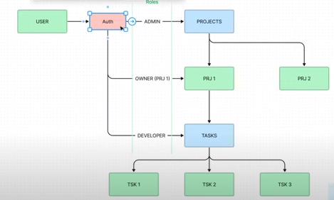

<p align="center">
  <a href="http://nestjs.com/" target="blank"></a>
</p>

[circleci-image]: https://img.shields.io/circleci/build/github/nestjs/nest/master?token=abc123def456
[circleci-url]: https://circleci.com/gh/nestjs/nest

  <p align="center">A progressive <a href="http://nodejs.org" target="_blank">Node.js</a> framework for building efficient and scalable server-side applications.</p>
    <p align="center">
<a href="https://www.npmjs.com/~nestjscore" target="_blank"></a>
<a href="https://www.npmjs.com/~nestjscore" target="_blank"></a>
<a href="https://www.npmjs.com/~nestjscore" target="_blank"></a>
<a href="https://circleci.com/gh/nestjs/nest" target="_blank"></a>
<a href="https://coveralls.io/github/nestjs/nest?branch=master" target="_blank"></a>
<a href="https://discord.gg/G7Qnnhy" target="_blank"></a>
<a href="https://opencollective.com/nest#backer" target="_blank"></a>
<a href="https://opencollective.com/nest#sponsor" target="_blank"></a>
  <a href="https://paypal.me/kamilmysliwiec" target="_blank"></a>
    <a href="https://opencollective.com/nest#sponsor"  target="_blank"></a>
  <a href="https://twitter.com/nestframework" target="_blank"></a>
</p>
  <!--[](https://opencollective.com/nest#backer)
  [](https://opencollective.com/nest#sponsor)-->

## Curso realizado de YouTube

Es importante destacar que este proyecto es el resultado de seguir una [lista](https://www.youtube.com/playlist?list=PLergODdA95kfcSoXqZZ-IDImO6YaQLYlG) de videos, cuyo autor es **codrr**

En este curso aprenderas como generar una API REST compleja con **NestJS** utilizando como lenguage core `TypeScript` y `TypeORM` como ORM SQL.

## Tecnologias a aplicar:

- POO.
- MySQL como base de datos.
- Utilización de Docker Compose.
- Configuracion de TypeScript.
- Configuracion de rutas, controladores, servicios y entidades.

## Descripción de la App

<p align="center">

</p>

Características de la misma:

- Sistema de autenticación de usuario (con JWT) que permitirá la posibilidad de trabajar con sus respectivos roles (gracias a la implementación de los Guards)
- 3 entidades fuertes: Users, Projects & Tasks
  - De las primeras 2 surgirá una entidad customizada: Users_Projects
- La capacidad de los roles es la siguiente:
  - Admin (podrá crear, editar, y borrar proyectos. Así como poder sobre los usuarios normales)
  - Owner (podrá crear, editar y borrar los proyectos que él tenga acceso)
  - Developer (podrá crear, editar y borrar 'tareas')

## Instalación

```bash
$ npm install
```

## Configurar las variables de entorno

**.develop.env** (Desarrollo)

- DB_HOST=localhost
- DB_PORT=5432 (ejemplo)
- DB_DATABASE=codrr_db (ejemplo)
- DB_USER=root (ejemplo)
- DB_PASSWORD=password (ejemplo)
- HASH_SALT=10
- JWT_SECRET=codrr@2023 (ejemplo)

## Corriendo la App

```bash
# docker compose
$ docker-compose up -d

# watch mode
$ npm run start:dev
```

## Swagger

Para ver aún más en detalle el funcionamiento de la api, tenemos el siguiente endpoint que nos permitirá apreciar, mediante Swagger, la documentación y así poder probarla:

- http://localhost:8000/docs

## License

Nest is [MIT licensed](LICENSE).
